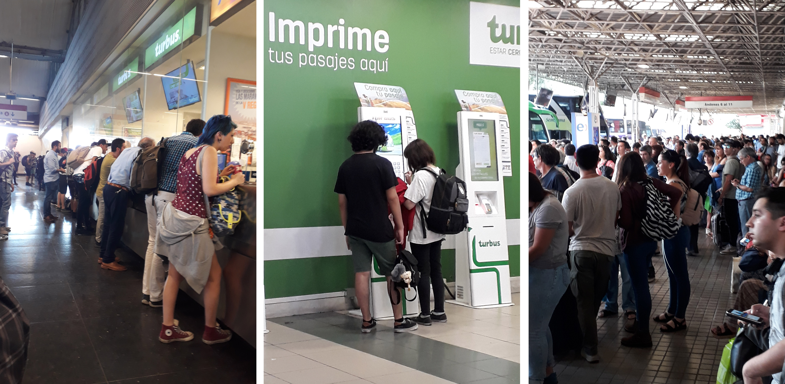
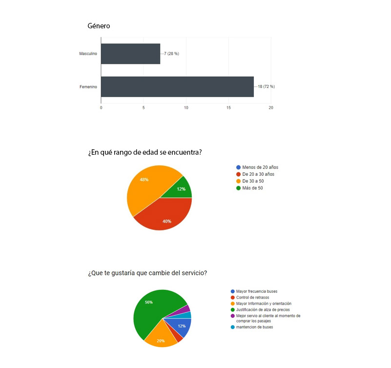

# Packbus

Packbus es una app móvil para comprar paquetes de pasajes en buses interurbanos al mejor precio. Además no necesitas imprimir tu pasaje: descarga el código QR, muéstralo al subir al bus y listo.

## Desarrollado para [Laboratoria](http://laboratoria.la)

# El reto

El reto que se nos planteó se titulaba "Nueva experiencia en empresas de buses". La situación era la siguiente: nos ha contactado Catalina una emprendedora viajera con una idea de negocio. Durante sus últimas vacaciones Catalina estuvo viajando por todo latinoamérica. Durante estos viajes Catalina tuvo que tomar muchos buses de todo tipo para llegar a ver los paisajes más lindos del continente. Durante sus viajes Catalina se dio cuenta que existen aún muchas oportunidades para mejorar la experiencia de todos los usuarios de este tipo de transporte: horarios, embarques, desembarques, compra de tickets en los terminales, compra de tickets online, cancelaciones, cambios de pasajes, etc. Adicionalmente, Catalina se dio cuenta que todas las plataformas de venta de tickets de bus tienen cosas por mejorar en Chile, Perú y México.

Luego de vivir todo esto, Catalina está pensando en emprender en este sector. Para ello ha contratado a tu squad para que la ayude a investigar más sobre los usuarios de este tipo de transportes y para que definan y prueben un MVP.

Con tu asesoría, ella podrá sustentar su idea de negocio a un grupo de inversión y así obtener el financiamiento necesario para emprender su negocio y mejorar la experiencia en este rubro.

# Research

## Entrevistas y encuestas

Nuestro squad, conformado por 6 integrantes, se dividió las tareas. Un grupo fue a terreno a los terminales de buses a consultar directamente a los usuarios que viajan.

Las preguntas que debían responder eran las siguientes:

1. ¿Cuál es tu principal motivo para viajar?

2. ¿Estás satisfecho con los horarios y frecuencias de salidas de buses? ¿Hay alguna diferencia de precio entre un horario y otro?

3. Al momento de comprar un pasaje, ¿con cuál de estas opciones realizas la compra?: Internet, ventanilla, máquina auto servicio, cupones, otro (especifique cuál)

4. ¿Cuál es el benefecio de comprar un pasaje con la opción que consideraste? ¿Y la principal dificultad?

5. ¿Alguna vez tuviste que devolver o cambiar un pasaje? Si la respuesta es sí... ¿cómo fue el proceso de devolución o cambio?

**Accesibilidad al servicio**

6. ¿Has tenido dificultad antes de iniciar el viaje? (retraso, problema técnico de la máquina, cambio de horario...)

7. En caso de haber sufrido alguna dificultad, ¿qué experiencia tienes con la respuesta por parte de la línea de bus para solucionar tu problema?

**Información en los vehículos**

8. ¿Su línea de bus cumple con informarte acerca de algún incidente sucedido con la máquina? (retraso, problema técnico de la máquina, cambio de horario...)

9. En caso de responder no, ¿consideras que es importante que se informe de cualquier incoveniente?

**Atención al cliente**

10. Considerando alguna dificultad que hayas experimentado al momento de viajar, ¿cómo ha sido la atención al cliente? ¿Te entregan respuestas eficientes en el caso de que existan inconvenientes con el servicio ofertado?

**Confort del servicio**

11. En relación precio/calidad ¿El costo del servicio ofertado cumple con tus espectativas de comodidad, eficiencia y limpieza del vehículo?

Las principales conclusiones a las que llegamos fue que el motivo principal del viaje son las vacaciones, probablemente influenciado por la época, ya que este trabajo se realizó en enero. Y el segundo motivo era laboral.
Con respecto a horarios la mayor parte de los usuarios se siente satisfecho, no así el resto del porcentaje de usuarios declara un servicio regular y finalmente malo.

Se registra una diferencia en alza de precios durante el fin de semana con mayor flujo de pasajeros.

En cuanto a la modalidad de compra sigue repuntando por muy poca diferencia la compra tradicional de ventanilla, debido a una asesoría directa y elecciones personalizadas. Sin embargo, una cantidad no menor de usuarios prefiere el canal online. Justifican la comodidad de hacerlo desde sus hogares, mejores precios con descuentos, ahorro de tiempo y evitar largas filas. Un pequeño porcentaje prefiere la compra a bordo en casos puntuales, de emergencia o imprevisto, a pesar de no poder elegir asiento. Se muestran satisfechos embarcando con rapidez en el horario que se encuentre.

Otro tema a considerar es el cambio o devolución del pasaje, donde el usuario dice no haber tenido mayores problemas por un cambio, pero en devolución se manifiesta descontento, ya que el reembolso solo alcanza el 85% del total pasaje y en algunos casos no se entrega devolución.

La siguiente pregunta evidencia el mayor descontento por parte de los usuarios: "En caso de haber sufrido alguna dificultad, ¿qué experiencia tiene con la respuesta por parte de la línea de bus para solucionar el problema?", algunas de las respuestas fueron:
- “Nunca resuelven nada. Toca aguantar”.
- “Pésima, no hay solución real, uno se debe acomodar a lo que sucede”.
- “Ninguna respuesta”.

Seguido de esta mala evaluación el usuario enfrenta situaciones de incidentes como retrasos, dificultades técnicas, cambio de horario, cambio de destino, poca o nada de información, todo ocurre en completo desconocimiento por parte de los encargados. Considerando que para el usuario la información es lo más importante y que es un derecho por el servicio prestado, declaran como deficiente la atención al cliente en este ámbito.

En relación al servicio ofertado versus la realidad se especifica que no cumple con las expectativas, precios muy elevados por un bus muchas veces desaseados, pagar menos significa un bus aún más incómodo y de menor calidad.

 

